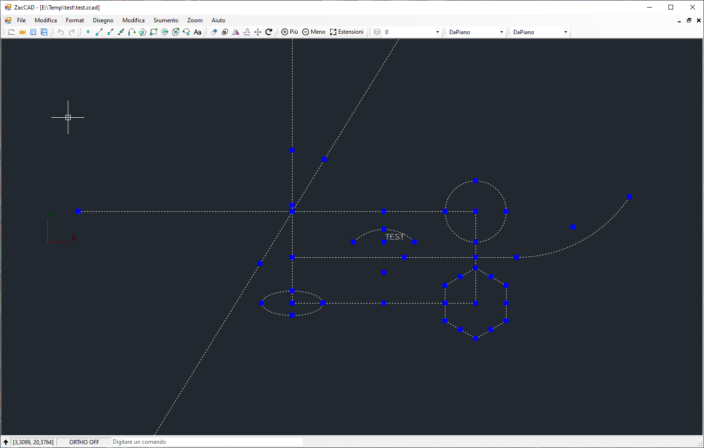

# ZacCAD
ZacCAD is developed on the basis of SharpCAD. It is a very simple 2D CAD drawing application developed by C#.

ZacCAD is free software; you can redistribute it and/or modify it under the terms of the [MIT License](https://opensource.org/licenses/MIT).

#### Building

Download the source code and open ./src/ZacCAD.sln by Visual Studio 2022, then you can directly compile and build this project.

#### Main Features

* Supports entities: point, line, xline, ray, polyline, circle, ellipse, arc, text.
* Zoom pan extend plus minus.
* Layer。
* Grip points.
* Snap.
* Basic editing tools: delete, copy, mirror, offset, move, rotate.
* Undo and Redo.
* Multiple Ways For Object Selection: Pick Single、Window、Cross.
* Open and Save *.zcad file.
* Import and Export *.dxf file.
* Command line
* Can switch between Italian and English.

#### Entities supported

* xpoint
* line
* xline
* ray
* polyline
* circle
* ellipse
* arc
* text

## To Do

#### Draw

* Dimensions

#### Modify

* Scale
* Stretch
* Trim
* Extend
* Fillet

## Contribute

Anyone and everyone is welcome to [contribute](CONTRIBUTING.md).

# LICENSE

This project is licensed under the [MIT License](LICENSE).

